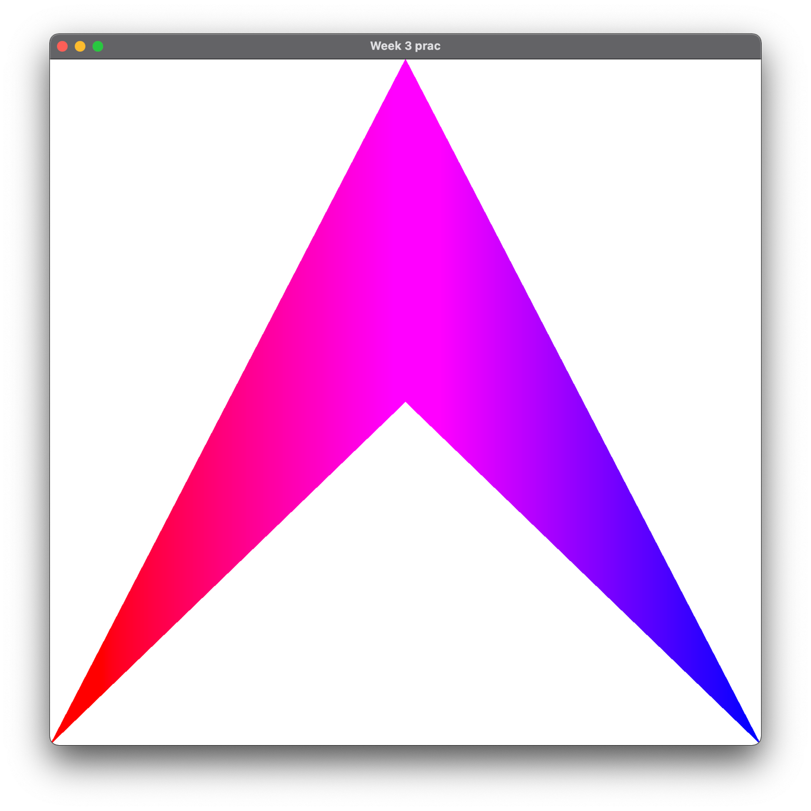
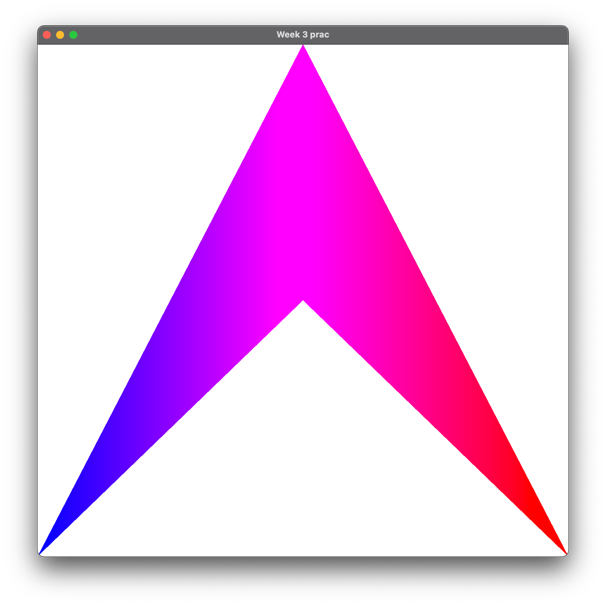
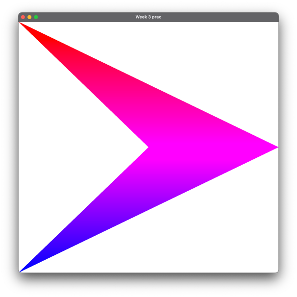
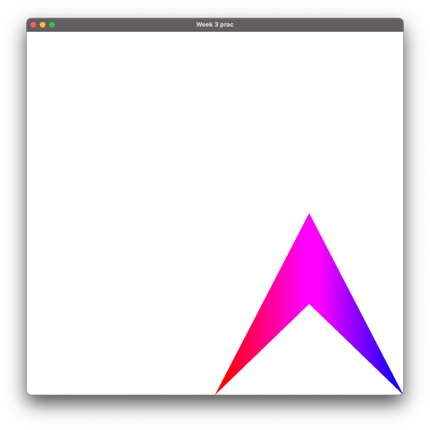
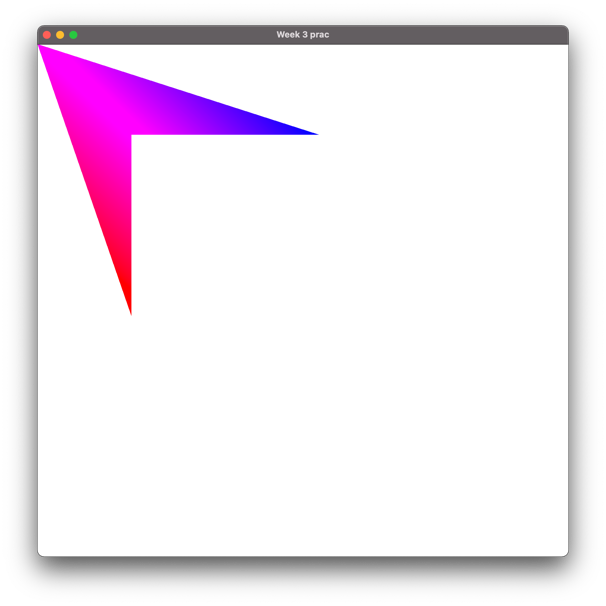
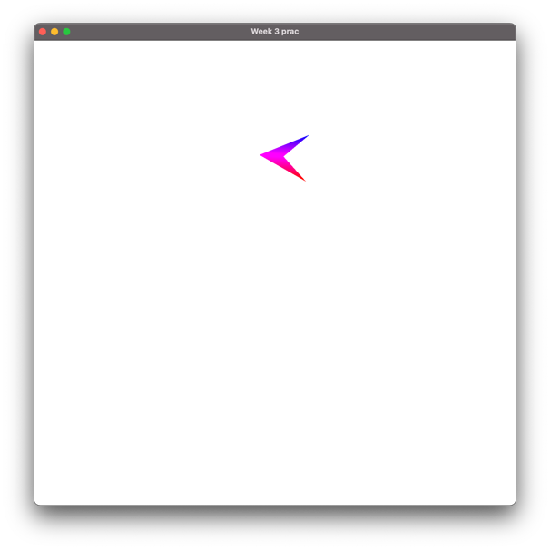
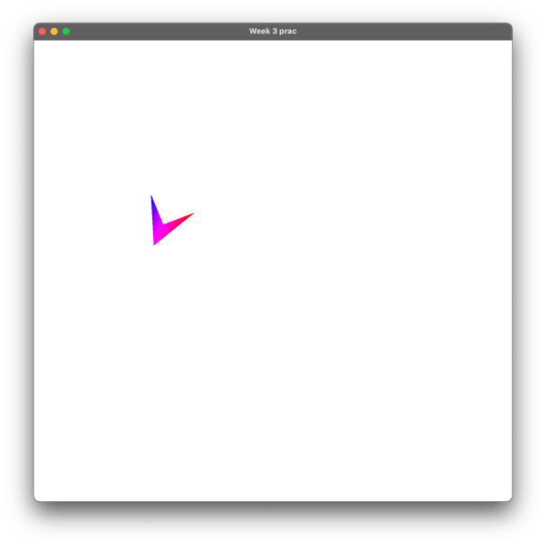
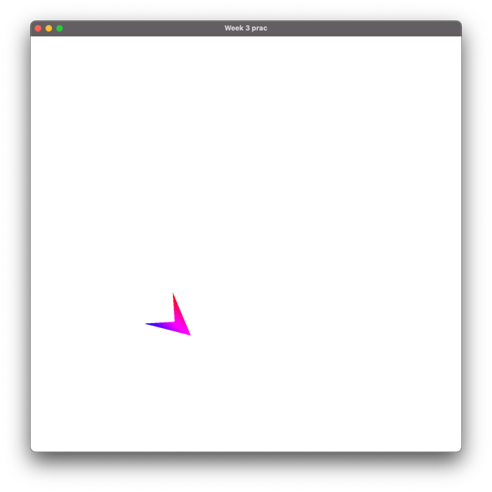
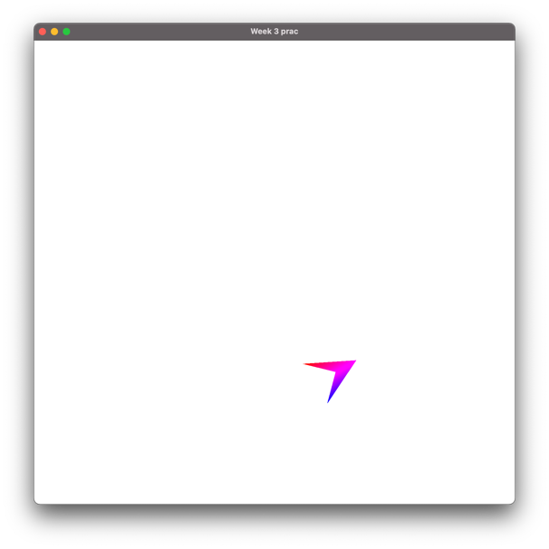

# COMP3170 - Week 3: 2D Transformations

In today's project, you will be writing your own Matrix methods for moving, rotating and scaling an object in 2D space. In future weeks, we'll be using the built-in Matrix methods from JOML ([documentation here](https://joml-ci.github.io/JOML/apidocs/org/joml/Matrix4f.html)), but we'd like you to understand how they operate. Use the documentation for clues!

### Remember to fetch and pull the most recent version of the COMP3170 LWJGL Library!

Today's repo contains four files:
* `Week3.java` – the main program, implementing IWindowListener
* `Scene.java` – code to model and draw a scene containing a simple plane (shown below)
* `vertex.glsl` – a basic vertex shader with vertex colours
* `fragment.glsl` – a basic fragment shader with vertex colours

If you run the code as is, it should draw the plane without any transformation:

## Complete the matrix code

The Plane class defines three static methods:
* `translationMatrix()`
* `rotationMatrix()`
* `scaleMatrix()`

Each of these methods writes the specified kind of matrix form into a pre-allocated destination matrix. You will want to use these methods to create your model matrix. 

The code for `translationMatrix()` has been provided. Complete the other two methods.

## Add a model matrix 

In `vertex.glsl`: Add code to the vertex shader to allow a model matrix to be passed as a uniform. Use this code to transform the vertex before writing it to `gl_Position`.

In `Scene.java`: Create a model matrix and pass it to the shader using `setUniform` when drawing the plane.

How would you set the matrix to achieve the following output?

|                              |                               |
| ---------------------------- | ----------------------------- |
| a) | b)    |
| c)   | d)   |

## Add animaton 

Following the example in lectures for adding and using deltaTime, update the code to make the ship move along a circular path like this:

|                              |                               |
| ---------------------------- | ----------------------------- |
| a) | b)    |
| c)   | d)   |

### Hints:
* Initialise the plane with its starting position, angle and size.
* On every frame:
    * Make the plane rotate on the spot.
    * Add forward motion in the plane’s local coordinate space.

## To receive a mark for today, show your demonstator:
* Your matrix methods.
* Your model matrix in your vertex shader.
* Your plane flying in a circle.

## Bonus: Seperate scene and plane code
As you may have noticed in the demo code, we're now moving to having our objects seperate from the scene class. See if you can refactor today's prac so the Plane is its own object, which the scene then instantiates.