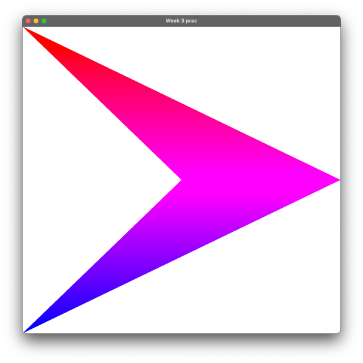
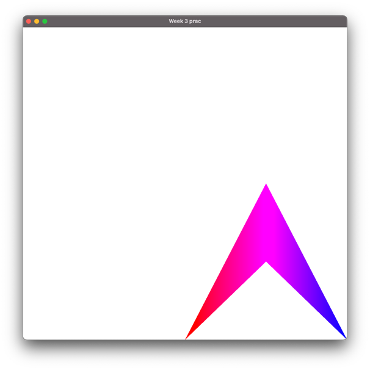
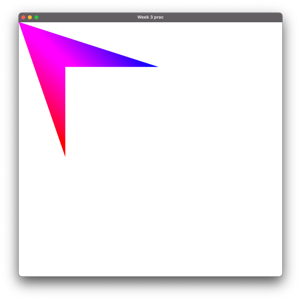
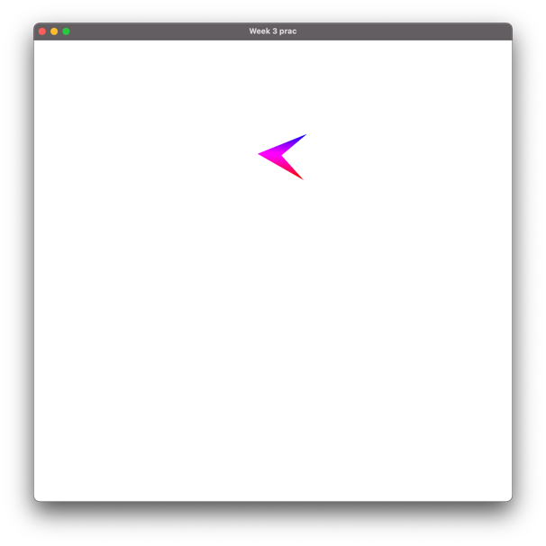
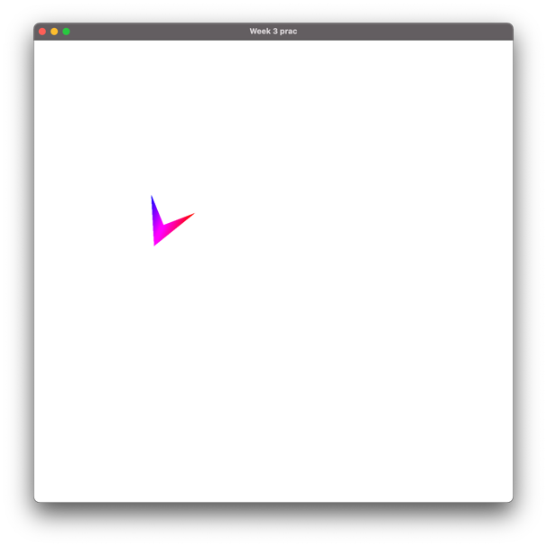
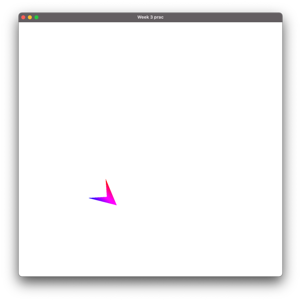
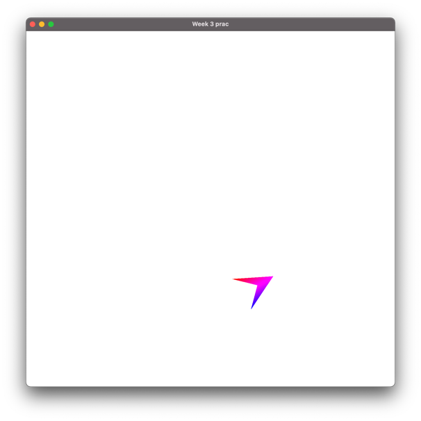

# COMP3170 - Week 3: 2D Transformations
In today's project, you will be using Matrix transformations to translate, rotae and scale an object in 2D space. Your understanding of the theory behind Matrix transformations will help you figure out how they operate.

### Remember to fetch and pull the most recent version of the COMP3170 LWJGL Library!

Today's repo contains four files:
* `Week3.java` – the main program, implementing IWindowListener
* `Scene.java` – code to model and draw a scene containing a simple plane (shown below)
* `vertex.glsl` – a basic vertex shader with vertex colours
* `fragment.glsl` – a basic fragment shader with vertex colours

If you run the code as is, it should draw the plane without any transformation:

## Understand JOML Matrix4fs

We now want to transform the Matrix, changing its translation, its rotation and its scale. We can do so using the Matrix4f class. Take a look at the [documentation](https://joml-ci.github.io/JOML/apidocs/org/joml/Matrix4f.html) and note down which methods would be useful for:

* Reset the matrix to a "neutral" form.

### Translation:
* Changing the plane's location by a certain amount relative to its coordinate space.
* Changing the plane's location by a certain amount relative to the world's coordinate space.
* Set the plane's location to another spot, scrubbing other transformations.

### Rotation:
* Changing the plane's rotation by a certain amount relative to its coordinate space around the Z axis.
* Changing the plane's rotation by a certain amount relative to the world's coordinate space around the Z axis.
* Set the plane's rotation to another direction around the Z axis, scrubbing other transformations.

### Scale:
* Changing the plane's size by a certain amount relative to its coordinate space.
* Changing the plane's size by a certain amount relative to the world's coordinate space.
* Set the plane's size to another amount, scrubbing other transformations.

Share your results as instructed by your instructor.

## Add a model matrix 
To apply transformations, we must first create a model matrix for the plane.

In `vertex.glsl`: Add code to the vertex shader to allow a model matrix to be passed as a uniform. Use this code to transform the vertex before writing it to `gl_Position`.

In `Scene.java`: Create a model matrix and pass it to the shader using `setUniform` when drawing the plane.

How would you set the matrix to achieve the following output?

|                              |                               |
| ---------------------------- | ----------------------------- |
| a) | b)    |
| c)   | d)   |

If you're getting stuck, consider:
* Are you doing the transformations in the right order (e.g. TRS order)?

* Do you have `a_position` and `u_modelMatrix` around the right way in the vertex shader?

## Add animaton 
Following the example in lectures for adding and using `deltaTime`, update the code to make the ship move along a circular path like this:

|                              |                               |
| ---------------------------- | ----------------------------- |
| a) | b)    |
| c)   | d)   |

<b>Hint: You'll want to set the plane's transformations with a starting position, angle and size. Then apply other transformations on each frame.</b>

This movement requires the plane to be flying towards its own "forward" direction. How might you change your code to keep it rotating, but instead have it fly straight upwards and off the screen?

## Seperate scene and plane code
As you may have noticed in the demo code, we're now moving to having our objects seperate from the scene class. See if you can refactor today's prac so the Plane is its own object, which the scene then instantiates. First, identify what should "belong" to the Plane class, and what should belong to the Scene class. Your instructor may ask you to perform this as the whole class or as groups.